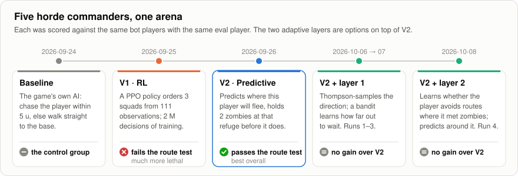
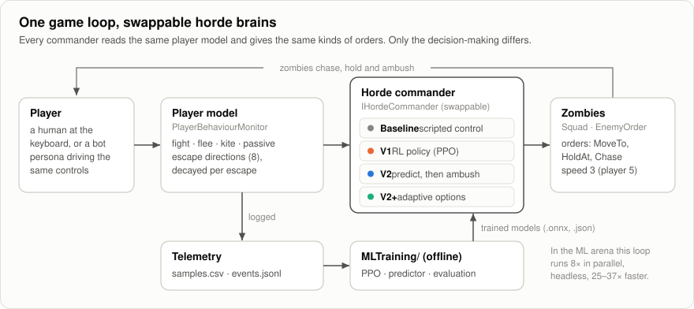
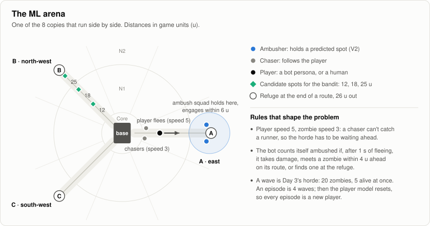
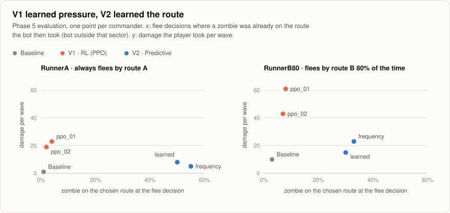
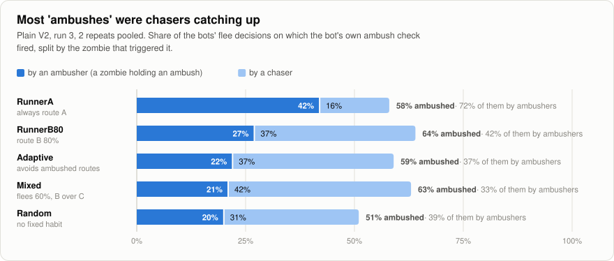
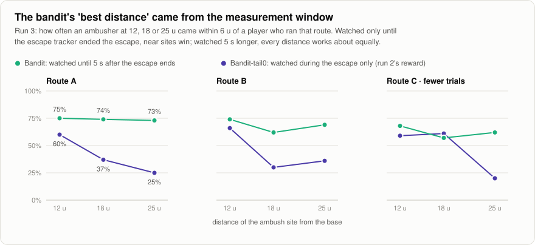
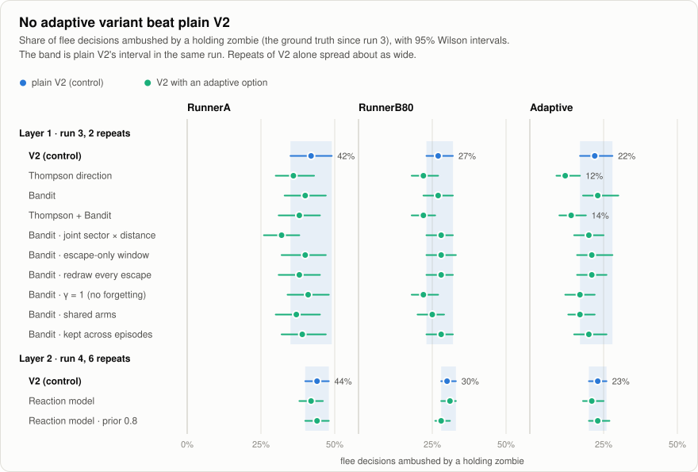

# Waste Land 2039

A 2D top-down zombie-survival and base-defense game made in Unity, and an experiment in teaching its zombie hordes to anticipate the player.

You defend a base for up to 30 days, and each day can bring a horde. You craft and fight, and when it goes badly, you run. This repository also holds a controlled comparison of several "horde commanders", the brains that decide where the zombies go. They range from the game's original scripted AI to a reinforcement-learning policy and a predictive model with adaptive add-ons. The question behind them:

> **Can a zombie horde learn how *this* player escapes, and be waiting there before they arrive?**

**Short answer.** A small predictive model plus scripted tactics (**V2**) can. Reinforcement learning (**V1**) learned to be lethal but never learned to anticipate. Three adaptive add-ons to V2, in two layers, were tested in four controlled runs, and none of them improved on it.



## Contents

- [The game](#the-game)
- [Branches](#branches)
- [The experiment](#the-experiment)
- [The commanders](#the-commanders)
- [How they were evaluated](#how-they-were-evaluated)
- [Results](#results)
- [Verdict by version](#verdict-by-version)
- [What the experiment taught](#what-the-experiment-taught)
- [Limitations](#limitations)
- [Reproducing the results](#reproducing-the-results)
- [Repository map](#repository-map)
- [Credits](#credits)

## The game

| | |
|---|---|
| Engine | Unity **2022.3.62f1** LTS, URP 2D |
| Genre | 2D top-down zombie survival and base defense, up to 30 days |
| Scenes | `Assets/MainMenu.unity` → `Assets/IntroScene.unity` (also the loading screen) → `Assets/MainGame.unity` |
| Systems | day timer and horde events (`GameTimer`, `HordeEventSpawner`, `HordeEvent` assets), ranged combat, inventory and crafting, intro, tutorial and dialogue |
| Input | Unity's legacy Input Manager, keyboard and mouse |

To play, open the project in Unity 2022.3.62f1, open `Assets/MainMenu.unity` and press Play.

## Branches

| Branch | What's on it |
|---|---|
| `main` | The game. |
| `experiment/enemy-ml` | The commander seam, the player model, telemetry, the ML arena and bot players, V1 (RL) and V2 (predictive). |
| `adaptive-horde` | Everything above, plus the adaptive layers (Thompson sampling, the ambush bandit, the player reaction model) and the evaluation tooling for them. |

The ML work is isolated on purpose. On the experiment branches the game still uses the original AI by default, and every learned commander is opt-in (*Tools > Enemy AI > Game Commander*).

## The experiment

### Why anticipation is the whole problem

The player moves at speed 5 and zombies at speed 3, so a zombie chasing a fleeing player never catches up. The only way to catch a runner is to be on their route **before** they flee. That makes "learn the player" a measurable problem: does the horde put zombies where this particular player is about to run?

### One loop, swappable brains



- **Player model** (`PlayerBehaviourMonitor`, 10 Hz). It labels each engagement as fight, flee, kite or passive, and keeps a decayed profile of where this player runs: 17 zones, which are a core plus 8 directions × 2 rings. In the game the profile is saved between sessions; in the arena it resets every episode.
- **Commander seam** (`IHordeCommander`). Every commander reads the same `HordeContext` (player model, zones, live enemies) and gives the same orders to squads of zombies: `MoveTo`, `HoldAt` or `Chase`. Only the decision-making differs, so the comparison is fair.
- **Telemetry**. Each session writes `samples.csv` and `events.jsonl`. Those files are the training data for the predictor and the ground truth for every metric below.

### The arena and the bot players

Humans produce a few dozen flee events per session, which is far too few to train or evaluate on. So the commanders were tested in a dedicated ML arena (`Assets/ML/Arena/`): 8 copies run side by side, each with a scripted bot that drives the real `PlayerController` under the same rules as a human. The headless eval player runs at 25–38× real time, in lockstep at 0.02 s of game time per frame.



| Bot persona | Behaviour | Role in the evaluation |
|---|---|---|
| **RunnerA** | always flees by route A (east) | the easiest habit to learn |
| **RunnerB80** | flees by route B 80% of the time | the "route test" persona |
| **Adaptive** | prefers A (0.8 / 0.1 / 0.1), cuts a route's weight to ×0.2 after being ambushed there, recovers after clean escapes | a player who learns from the horde |
| Mixed | flees 60% of the time, B over C | partly predictable |
| Kiter | shoots, steps back, prefers C | stays in contact |
| Random | equal, jittered weights | no habit to learn |
| Fighter | never flees | control for pressure |

Persona parameters are re-sampled every episode. An episode is 4 waves of Day 3's horde (20 zombies, 5 alive at once). After each episode the player model resets, so every episode is a new player who has to be learned from scratch.

## The commanders

| Version | Idea | Learning | Key code |
|---|---|---|---|
| **Baseline** | The game's original AI: a zombie chases the player within 5 units, otherwise walks straight to the base. | none | `Commanders/BaselineCommander.cs` |
| **V1 · RL** | A policy orders 3 squads (keep, autonomous, chase, or hold one of 17 zones), plus which squad the next reinforcement joins. It reads 111 observations, including the player profile. | PPO (Unity ML-Agents), offline, 2 M decisions per run against the bots | `Commanders/RLCommander.cs`, `Learning/`, `MLTraining/config/` |
| **V2 · Predictive** | "Learn to predict, rules act." Predict which way this player runs from the base, and keep 2 of the 5 active zombies holding that route's refuge before the flee. The rest chase as usual. | online counting (`FrequencyPredictor`); optionally an offline softmax regression (`LearnedPredictor`) | `Commanders/PredictiveCommander.cs`, `Prediction/` |
| **V2 + layer 1** | Thompson-sample the ambush direction instead of always taking the most likely one; a discounted Beta bandit learns *how far out* to wait (12, 18 or 25 units), rewarded on contact. | online, per episode | `Prediction/AmbushBandit.cs` |
| **V2 + layer 2** | Learn whether the player avoids a route after meeting zombies there (lose-shift, Bayesian over 5 avoidance strengths), and shift the prediction accordingly. | online, per episode | `Prediction/ReactionModel.cs` |

All paths are under `Assets/Scripts/EnemyAI/`. Every adaptive option is a command-line flag on the same V2 commander, and with all options off it reproduces V2 exactly (same orders, spawns and random draws).

<details>
<summary>V1 training details</summary>

- **Reward per wave:**
  - +1 per escape intercepted (a zombie within 2.5 units, 1 s or more after flee onset);
  - +0.01 per HP of player damage;
  - +1 if the player dies;
  - +0.002 per second engaged;
  - −0.5 if the wave ends with the player unharmed.

  `v1_ppo_02` adds a +2 bonus when the intercepting zombie comes from in front of the player.
- **PPO** (`MLTraining/config/commander_ppo.yaml`): 2 × 128 hidden units, batch 256, buffer 4096, learning rate 3e-4 (linear decay), β 5e-3, ε 0.2, λ 0.95, γ 0.99, 3 epochs, horizon 128, 2 M steps.
- **Curriculum:** runners only, then + Mixed, Kiter and Fighter at 20% of training, then + Adaptive and Random at 50%. Routes are shuffled every episode, so the only way to find a runner's route is to read the profile.
- **Two runs:**

  | Run | Action scheme | Time | Policy entropy at the end |
  |---|---|---|---|
  | `v1_ppo_01` | PerSquad: every squad, every 1 s, branches [20, 20, 20, 3] | 1.5 h | 82% of maximum |
  | `v1_ppo_02` | RetaskOne: one squad every 2 s, branches [4, 19, 3], + head-on bonus | 2.0 h | 67% of maximum |

  Both ran 3 headless players × 8 arenas, at about 280–370 decisions/s.

</details>

<details>
<summary>V2 design details</summary>

- **What it counts:** the direction of the *first escape of each engagement*, in 8 sectors, per start zone, decayed ×0.85 per escape. Later escapes are mostly the bot being flushed out of a refuge, and they would drown the signal.
- **Where it predicts from:** the base, because an ambush has to be placed before the flee.
- **How the ambush behaves:** it is sticky (it moves only past a margin), it splits between two non-adjacent directions when they're close, and its zombies spawn at the post only when they're at least 10 units from the player, which keeps them off camera.
- **The learned predictor:** softmax regression on the 66-value `EscapeFeatures` vector logged at every escape, trained in NumPy (`MLTraining/predictor/`). The shipped model, `Assets/ML/Predictors/EscapePredictor_v1.json`, uses history only.

</details>

## How they were evaluated

- **Same build, same bots.** All commanders ran on the same headless eval player, with the same 8 arenas (7 personas; RunnerB80 runs in two) and fixed seeds. Each run is 40 game-minutes per arena, about 7–8 episodes per persona. For the adaptive layers, every variant ran on one build and differed only by a command-line flag, with plain V2 as the control in every run.
- **Repeats and intervals.** Intervals are 95% Wilson intervals. The adaptive runs ran each variant once in run 1, twice in runs 2–3 and six times in run 4, executed in rounds, so slow drift can't line up with one variant. The repeats are pooled, and each one is also reported on its own as the run-to-run noise.
- **Scale.** The adaptive study alone took 65 runs of 40 game-minutes with 8 arenas each, about 350 hours of simulated play.

| Metric | Meaning |
|---|---|
| **Zombie on route** | When the bot decides to flee, a zombie is already in the sector of the route it then takes. Only decisions made outside that sector count, so chasers don't. |
| **Ambush on route** (V2) | V2's ambush was assigned to the bot's route at flee onset. |
| **Route predicted** (top-1) | The commander's most likely route is the bot's route. Chance is 33%. |
| **Bot ambushed** | The bot's own check: after 1 s of fleeing it takes damage, meets a zombie within 4 units ahead on its route, or finds one at the refuge. |
| **Ambushed by an ambusher** | The same check, credited to a zombie that was *holding* an ambush rather than chasing. This is the ground truth from run 3 on, and the primary outcome for the adaptive layers. |
| **Damage and deaths per wave** | Pressure, to make sure anticipation isn't bought by gutting the rest of the horde. |

**The route test** (plan §4): against RunnerB80, does the commander have zombies on route B *before* the flee far more often than chance (1/3), and do its ambushes improve over the session?

## Results

### V1 (RL) learned pressure, not anticipation

Both PPO runs are far more dangerous than Baseline against every persona. Fleeing bots are ambushed 2–5× as often, and the Fighter dies in up to 116 of 122 waves. But neither run learned where a runner goes. Both learned a fixed ring of holding squads, heavy on the south-west and the same for every persona, and won by chasing hard.

| RunnerB80 (flees by B 80%) | Baseline | `v1_ppo_01` | `v1_ppo_02` |
|---|---|---|---|
| Route predicted (chance 33%) | – | 23% | 19% |
| Hold orders sent to route B's sector | – | 2% | 0% |
| Bot ambushed | 27% | 70% | 73% |
| Damage per wave · deaths | 10 · 4 of 54 | 61 · 40 of 76 | 43 · 24 of 68 |

*Deterministic play, Phase 4 batches. Sampled play (`-stochastic`) tells the same story: RunnerB80's route is predicted at 19–23%.*

The likely causes: the reward pays the same for a zombie that waited on the route as for one that ran the player down, and chasing is much easier to discover. On top of that, the action space is large for a 2 M-decision budget.

### V2 learned the route

V2 passes the route test that V1 failed. It does this while staying close to Baseline lethality for players who don't run a fixed route, because it diverts only 2 of the 5 active zombies.



| | Baseline | V1 `ppo_01` | V1 `ppo_02` | **V2 frequency** | V2 learned |
|---|---|---|---|---|---|
| RunnerA: zombie on route | 1% | 4% | 2% | **55%** | 50% |
| RunnerB80: zombie on route | 3% | 8% | 7% | **33%** | 30% |
| Mixed: zombie on route | 5% | 21% | 9% | **29%** | 29% |
| RunnerB80: damage per wave · deaths | 10 · 3 of 53 | 61 · 40 of 76 | 43 · 24 of 68 | 23 · 11 of 58 | 15 · 6 of 56 |
| Fighter: deaths | 26 of 64 | 59 of 80 | 116 of 122 | 27 of 63 | 27 of 64 |

*Phase 5 batches, deterministic play for V1.*

- **The ambush is on the bot's route** at 83% [73–90] of RunnerA's flee decisions and 48% [41–55] of RunnerB80's (chance 33%). For RunnerB80 that rises to about 65% once the profile has seen 2 or more escapes.
- **It improves within an episode.** RunnerB80's flees end ambushed in 49% of wave 1 and 65–73% of waves 2–4, while Baseline stays flat at about 27%.
- **"Assigned" vs "physically there".** The ambush can leave its post to chase, so the assigned rate (48%) is higher than the rate of a zombie physically on the route (33%).

### Counting beat learning where it mattered

The learned predictor is clearly more accurate *at the moment the flee starts*, but the ambush has to be placed *before* it.

| Top-1 escape direction (chance 12.5%) | Held-out sessions, all escapes | Base-start escapes | RunnerB80 (unseen persona) |
|---|---|---|---|
| Frequency (counting) | 45% | 29% | 53% |
| Learned, with live threat features | **67%** | **58%** | **74%** |
| Learned, history only | 56% | 35% | 59% |

| Route predicted from the base, at bot flee decisions | Frequency | Learned (history only) |
|---|---|---|
| RunnerB80 | **78%** | 63% |
| RunnerA | **99%** | 98% |
| Mixed | **56%** | 53% |

The learned model's advantage comes from the threat around the player at flee onset, and an ambush placed in advance can't know that. Online, that model made the ambush thrash: about 10 orders per game-minute, against 2.5 for the frequency model. So the frequency predictor is V2's default, and the learned one ships as an option. The bots also choose routes by a weighted roll that ignores context, so on them a counting model is close to optimal. Context may matter more for humans.

### The adaptive layers didn't beat V2

The adaptive layers were four controlled runs on branch `adaptive-horde`. Each run fixed the measurement problem the previous one exposed.

| Run | Date | What changed | What it showed |
|---|---|---|---|
| 1 | 2026-10-06 | Thompson direction; ambush bandit with a 2.5-unit contact reward | **The reward never fired:** 0 of 277 RunnerA trials under the bandit made contact (1 of 2,231 across all seven variants), because fleeing bots never get that close. With nothing but misses, the untried arms' optimistic priors pulled ambushes **off** the route (RunnerA ambush on route 82% → 53% with Thompson + Bandit). |
| 2 | 2026-10-07 | contact radius 6 (a holding zombie's engage radius); the bandit picks only the distance; 2 repeats | The bandit optimized its reward (RunnerA contact 4% → 11%) and "learned" that 12 units is best, but the bots weren't ambushed more (RunnerB80 68% → 58%). |
| 3 | 2026-10-07 | **ground truth:** ambusher vs chaser; contact watched 5 s past the escape end | "Bot ambushed" had mostly counted chasers. With the full window, every distance works equally, so run 2's "best distance" was an artifact. Bandit = V2; Thompson is worse for every persona. |
| 4 | 2026-10-08 | layer 2, the player reaction model; 6 repeats | No effect on real ambushes. The adjustment didn't even improve prediction, because the model learned from the wrong signal. |

**"Bot ambushed" was mostly chasers.** Splitting the bots' ambush check by the zombie that triggered it changed what the earlier numbers meant. For every persona except RunnerA, most ambushes came from chasers catching up:



**The measurement window manufactured a result.** The escape tracker ends most escapes before the bot reaches the refuge where V2 waits. Scored only during the escape, near sites looked best. Watched 5 s longer, the three distances score about the same:



**With the ground truth, no variant beats plain V2.** Every interval overlaps V2's band, and the Thompson variants fall below it for the Adaptive persona:



| Ambushed by an ambusher | V2 | Thompson | Bandit | Thompson + Bandit | Reaction (run 4) |
|---|---|---|---|---|---|
| RunnerA | 42% | 36% | 40% | 38% | 42% (V2: 44%) |
| RunnerB80 | 27% | 22% | 27% | 22% | 31% (V2: 30%) |
| Adaptive | 22% | **12%** | 23% | 14% | 21% (V2: 23%) |

*Run 3 (2 repeats) and run 4 (6 repeats). In run 4 the six repeats of plain V2 alone ranged from 17% to 28% for Adaptive.*

Against the Adaptive bot, the bottleneck is prediction, not placement. V2's top-1 route prediction for it is 24%, below chance, because the bot avoids exactly the route the counts point at. The reaction model was meant to fix that. But it counted any zombie within 6 units on the way out as "met", including chasers behind the player. That fired on 74% of Adaptive's outings, while the bot itself reacted on 56% of its flees, so the model couldn't tell this bot from players who don't react.

## Verdict by version

| Version | Anticipates routes | Pressure | Verdict |
|---|---|---|---|
| Baseline | no (1–3% on route) | low | The control. Easy to outrun. |
| V1 `ppo_01` / `ppo_02` | **no** (fails the route test) | very high | Strong as a difficulty knob, but lethal for the wrong reason: zombies arrive from behind. It would need tuning before a human plays against it. |
| **V2, frequency predictor** | **yes** (55% / 33% on route; 83% / 48% ambush assigned) | near Baseline | **The best commander.** Cheap, interpretable (every `prediction` event logs the probabilities behind the ambush), and it learns within a few escapes. |
| V2, learned predictor | yes, slightly less | near Baseline | More accurate at flee onset, but that accuracy depends on information a pre-placed ambush doesn't have. Kept as an option. |
| V2 + Thompson direction | worse | near V2 | Exploration costs ambushes against predictable players and didn't help against the adaptive one, whose routes are already near maximum entropy (1.5 of 1.58 bits). |
| V2 + ambush bandit | same as V2 | near V2 | Learns its reward correctly, but in this arena *where along the route* to wait doesn't matter, so there's nothing to learn. |
| V2 + reaction model | same as V2 | near V2 | The idea is sound in simulation (top-1 33% → 57% in the scripted harness), but it learned from a signal that isn't what the player reacts to. |

Every adaptive option is **off by default**. In MainGame, Baseline stays the default too; V2 and RL are menu options.

## What the experiment taught

1. **RL learns what the reward pays for.** V1's reward didn't distinguish waiting on a route from running a player down, and chasing is easier to discover. A reward for anticipation (for example, a hindsight bonus for holding the escape's destination sector) is the obvious next attempt; it wasn't run.
2. **Splitting the job worked better than learning it end to end.** A counting model plus scripted tactics passed the test that PPO failed, with no training budget.
3. **Offline accuracy isn't usefulness.** The more accurate predictor was accurate for a reason the ambush couldn't use.
4. **Build the ground truth before optimizing.** The proxies misled at every step: the 2.5-unit "intercepted" was about 0 for fleeing players, the bandit's reward rose without any rise in real ambushes, and "bot ambushed" mostly counted chasers.
5. **A measurement window can manufacture a result.** Run 2's learned preference for near ambush sites disappeared once contact was watched to the end of the run.
6. **To model how a player reacts, observe what the player reacts to.** The commander's "a zombie came near" isn't the player's "I was cut off ahead".
7. **Controls and repeats are cheap insurance.** Several single-run differences of 5–10 points were inside the run-to-run noise.

## Limitations

- **Bots only.** No human playtests were run. Humans may react to ambushes differently from the Adaptive bot, and context-aware prediction may matter more for them.
- **One arena layout:** three straight routes to fixed refuges. On a map with detours or no fixed refuge, ambush placement could matter.
- **Short learning windows.** Every model resets each episode (4 waves, about 15 flees). In MainGame the profile and the bandit persist across sessions; the reaction model isn't wired into MainGame.
- **Partly circular test.** The Adaptive bot's avoidance rule has the same form as the reaction model, so a win would have been partly circular. The loss is still informative.
- **Power.** Runs 2–3 could detect differences of about 10 points and run 4 about 5. Ground-truth attribution on damage uses the nearest zombie within 2.5 units.
- **V1's budget.** Two runs of 2 M decisions each. A longer run, route-level actions or a hindsight reward might change the V1 picture.

## Reproducing the results

The scripts target macOS, the Unity 2022.3.62f1 install from Unity Hub, and zsh. The analysis tools are plain Python 3 with NumPy.

1. Switch to the branch and check the build:

   ```bash
   git switch adaptive-horde
   ```

   ```bash
   MLTraining/tools/compile-check.sh
   ```

   ```bash
   MLTraining/tools/logic-tests.sh
   ```

2. Build the headless eval player, with the Unity Editor closed (with it open, use *Tools > Enemy AI > Build Eval Player*). It contains the `MLArena_Eval_Baseline`, `_RL` and `_V2` scenes and `MLArena_Data`:

   ```bash
   MLTraining/build_eval_player.sh
   ```

3. Run one commander for 40 game-minutes per arena:

   ```bash
   MLTraining/eval.sh MLArena_Eval_V2 40
   ```

4. Compare two telemetry batches, given by their timestamp prefixes:

   ```bash
   python3 MLTraining/tools/arena-report.py --compare BASELINE_BATCH OTHER_BATCH --markdown
   ```

5. Re-run the adaptive study. The first command is runs 2–3 (layer 1 with ablations), the second is run 4 (layer 2):

   ```bash
   MLTraining/eval_adaptive.sh 40 --ablations
   ```

   ```bash
   MLTraining/eval_adaptive.sh 40 --set reaction --repeats 6
   ```

Notes:
- `eval.sh` takes extra flags after the minutes, for example `-stochastic` for sampled RL play, or the V2 options `-v2Predictor Learned`, `-v2Thompson`, `-v2Bandit` and `-v2Reaction`.
- Telemetry is written to `~/Library/Application Support/DefaultCompany/Waste Land 2039/EnemyAITelemetry/`.
- Each adaptive run writes a full `report.md` to `MLTraining/results/adaptive_eval/<stamp>/`.

**V1 training** uses ML-Agents Release 21: `com.unity.ml-agents` 3.0.0-exp.1 in Unity, and `mlagents` 1.0.0 with torch 2.1.2 on Python 3.10.

1. Create the conda env. The script records the Apple Silicon workarounds:

   ```bash
   MLTraining/setup_env.sh
   ```

2. Build the `MLArena_RL` scene to `MLTraining/builds/MLArena_RL.app`, then train:

   ```bash
   MLTraining/train.sh v1_ppo_01 3
   ```

3. Install the result with *Tools > Enemy AI > Install Latest Commander Model*.

**V2 predictor:**

1. Collect training data with the Baseline commander, the full persona pool and shuffled routes:

   ```bash
   MLTraining/eval.sh MLArena_Data 240
   ```

2. Train on that batch:

   ```bash
   python3 MLTraining/predictor/train_predictor.py --data BATCH --no-threat --out Assets/ML/Predictors/EscapePredictor_v1.json
   ```

3. Evaluate route prediction at the bots' flee decisions:

   ```bash
   python3 MLTraining/predictor/evaluate_predictors.py --batch BATCH --decisions
   ```

**Trying the commanders yourself.** In the Editor, *Tools > Enemy AI > Game Commander* switches MainGame between Baseline, RL and V2. *V2 Option: Thompson Direction* and *V2 Option: Ambush Bandit* toggle layer 1 (the reaction model runs only in the arena, via `-v2Reaction`). Press `` ` `` in Play mode for the overlay, which shows the active commander, the engagement state and the live player profile. Open `Assets/ML/Arena/MLArena.unity` to watch the bots: `[` and `]` switch arenas, `O` shows the overview, and `H` hands the focused arena to you.

## Repository map

| Path | Contents |
|---|---|
| `Assets/Scripts/EnemyAI/` | the experiment's runtime code: `Commanders/`, `Prediction/`, `Learning/`, `PlayerModel/`, `Zones/`, `Telemetry/`, `Bots/` and `Arena/` |
| `Assets/ML/` | the arena scenes and prefabs, persona assets, trained models (`Models/*.onnx`), the predictor (`Predictors/*.json`) and settings |
| `MLTraining/` | training and evaluation scripts, PPO configs (`config/`), the predictor pipeline (`predictor/`), metrics (`analysis/`) and developer tools (`tools/`: compile check, logic tests outside Unity, `arena-report.py`). `builds/` and `results/` are git-ignored. |
| `reports/` | the dated write-ups this README summarizes: one per phase, one per adaptive run, and a full write-up of the adaptive study |
| `docs/figures/` | the figures in this README, generated by `make_figures.py` from the reports' numbers |

Start with `reports/2026-09-25-phase4-rl-commander.md` (V1), `reports/2026-09-26-phase5-v2-predictive.md` (V2) and `reports/2026-10-08-adaptive-horde-writeup.md` (layers 1–2).

## Credits

The experiment's division of work is set out in [section 10 of the adaptive-horde write-up](reports/2026-10-08-adaptive-horde-writeup.md#10-who-did-what): the idea, the decisions at each step and every evaluation run were Lawrence's; the code, tests, evaluation tooling, analysis and reports were written by Claude (Anthropic's AI assistant, through Claude Code) at Lawrence's request.
